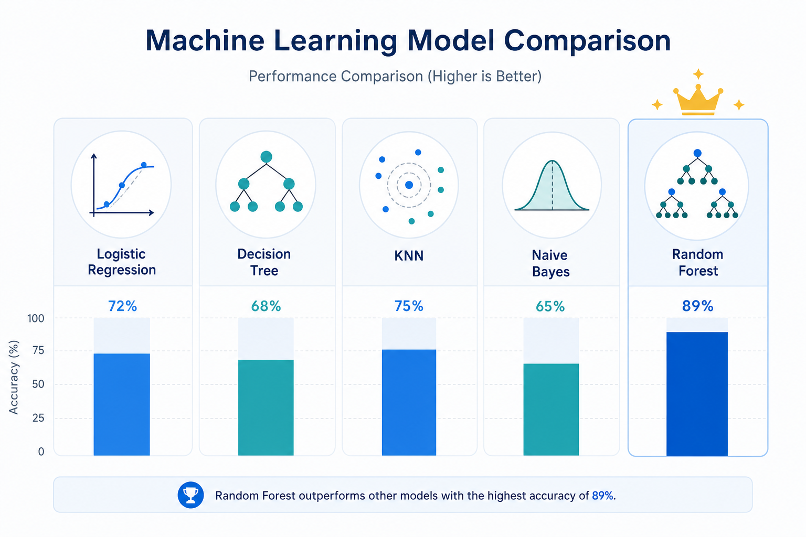

<p align="center">
  
</p>

<h1 align="center">Credit Card Default Prediction</h1>

<p align="center">
  <strong>Predicting credit card payment defaults using classical ML models</strong>
</p>

<p align="center">
  <a href="#problem-statement">Problem Statement</a> •
  <a href="#dataset-description">Dataset</a> •
  <a href="#github-repository-link">Repo</a> •
  <a href="#models-used">Models & Results</a> •
  <a href="#streamlit-app-features">App</a> •
  <a href="#project-structure">Structure</a>
</p>

<p align="center">
  
  
  
</p>

---

## Problem Statement

Predicting whether a credit card client will default on their payment next month, using historical payment data and client demographics from Taiwan (2005). This is a binary classification problem where the goal is to identify potential defaulters based on their credit history, demographic information, and past payment behavior.

The entire pipeline, from data ingestion to an interactive web dashboard, is built as a single deployable application using Streamlit.

---

## Dataset Description

**Default of Credit Card Clients** from the [UCI Machine Learning Repository](https://archive.ics.uci.edu/dataset/350/default+of+credit+card+clients)

| Property | Value |
|----------|-------|
| Total Instances | 30,000 |
| Number of Features | 23 |
| Target Variable | `default payment next month` (1 = default, 0 = no default) |
| Task Type | Binary Classification |
| Class Distribution | 77.9% No Default, 22.1% Default (imbalanced) |
| Origin | Taiwan, 2005 |

**Features:**

| Feature | Description |
|---------|-------------|
| LIMIT_BAL | Amount of given credit (NT dollar) |
| SEX | Gender (1 = male, 2 = female) |
| EDUCATION | Education level (1 = graduate school, 2 = university, 3 = high school, 4 = others) |
| MARRIAGE | Marital status (1 = married, 2 = single, 3 = others) |
| AGE | Age in years |
| PAY_0 to PAY_6 | Repayment status from April to September 2005 (-1 = paid duly, 1-9 = months of delay) |
| BILL_AMT1 to BILL_AMT6 | Amount of bill statement (April to September 2005) |
| PAY_AMT1 to PAY_AMT6 | Amount of previous payment (April to September 2005) |

---

## GitHub Repository Link

**Repository:** [https://github.com/buildwithsushmita/credit-card-default-prediction](https://github.com/buildwithsushmita/credit-card-default-prediction)

**Live Streamlit App:** [https://credit-card-default-prediction-uci.streamlit.app](https://credit-card-default-prediction-uci.streamlit.app)

---

## Models Used

The following 5 classification models were implemented and evaluated on the same dataset using an 80/20 stratified train-test split:

1. Logistic Regression
2. Decision Tree Classifier
3. K-Nearest Neighbor (kNN) Classifier
4. Naive Bayes (Gaussian) Classifier
5. Random Forest (Ensemble) Classifier

<p align="center">
  
</p>

### Comparison Table

| ML Model Name | Accuracy | AUC | Precision | Recall | F1 | MCC |
|---------------|----------|-----|-----------|--------|-----|-----|
| Logistic Regression | 0.8077 | 0.7076 | 0.6868 | 0.2396 | 0.3553 | 0.3244 |
| Decision Tree | 0.8102 | 0.7213 | 0.6250 | 0.3542 | 0.4521 | 0.3683 |
| kNN | 0.7928 | 0.7016 | 0.5487 | 0.3564 | 0.4322 | 0.3233 |
| Naive Bayes | 0.4160 | 0.6516 | 0.2496 | 0.8176 | 0.3824 | 0.1111 |
| Random Forest (Ensemble) | 0.8153 | 0.7678 | 0.6558 | 0.3474 | 0.4542 | 0.3815 |

### Observations

| ML Model Name | Observation about model performance |
|---------------|-------------------------------------|
| Logistic Regression | Achieves good accuracy (80.8%) but has very low recall (24%), meaning it misses most actual defaulters. High precision (68.7%) indicates that when it does predict default, it is usually correct. The model is too conservative for this imbalanced dataset and works as a solid baseline. |
| Decision Tree | Better balance between precision (62.5%) and recall (35.4%) compared to Logistic Regression. The max_depth of 10 prevents overfitting. AUC of 0.72 shows reasonable discrimination ability. Offers good interpretability through feature importance. |
| kNN | Lowest accuracy among non-Naive Bayes models (79.3%). The distance-based approach struggles with the 23-dimensional feature space due to the curse of dimensionality. Precision drops to 54.9% while recall stays similar to Decision Tree, indicating more false positives. |
| Naive Bayes | Achieves the highest recall (81.8%) but at the cost of very low accuracy (41.6%) and precision (25%). The Gaussian independence assumption is heavily violated since payment history features are correlated. Flags too many non-defaulters incorrectly. |
| Random Forest (Ensemble) | Best overall performer across most metrics: highest accuracy (81.5%), best AUC (0.77), best F1 (0.45), and best MCC (0.38). The ensemble of 100 trees captures complex feature interactions better than any individual model. |
| **Overall Winner for this dataset** | **Random Forest (Ensemble)** - Delivers the best trade-off across all evaluation metrics. The ensemble approach handles feature correlations and class imbalance more effectively than any single model, making it the most reliable choice for credit default prediction. |

---

## Streamlit App Features

| Feature | Description |
|---------|-------------|
| Dataset upload (CSV) | Upload test data via the sidebar |
| Model selection dropdown | Choose any of the 5 trained models |
| Evaluation metrics display | All 6 metrics (Accuracy, AUC, Precision, Recall, F1, MCC) |
| Confusion matrix | Visual heatmap of predictions vs actual |
| Classification report | Detailed per-class precision, recall, F1 |
| All models comparison | Side-by-side table and charts on current data |

---

## Quick Start

```bash
# clone the repo
git clone https://github.com/buildwithsushmita/credit-card-default-prediction.git
cd credit-card-default-prediction

# install dependencies
pip install -r requirements.txt

# train all models (downloads dataset automatically)
cd model && python train_models.py && cd ..

# launch the app
streamlit run app.py
```

---

## Project Structure

```
credit-card-default-prediction/
├── app.py                 # Streamlit web app
├── requirements.txt       # Dependencies
├── README.md              # This file
├── test_data.csv          # Held-out test split (6,000 rows)
├── model_results.csv      # Pre-computed metrics
├── assets/                # Images for README
│   ├── hero_banner.png
│   └── model_comparison.png
└── model/
    ├── train_models.py    # Model training script
    ├── scaler.pkl         # StandardScaler (for LR and kNN)
    ├── logistic_regression.pkl
    ├── decision_tree.pkl
    ├── knn.pkl
    ├── naive_bayes.pkl
    └── random_forest.pkl
```

---

## Tech Stack

| Tool | Purpose |
|------|---------|
| Python | Core language |
| scikit-learn | Model training and evaluation |
| Streamlit | Interactive web dashboard |
| pandas / NumPy | Data manipulation |
| matplotlib / seaborn | Visualizations |
| joblib | Model serialization |

---

<p align="center">
  <sub>Built as part of the Machine Learning course, M.Tech (AI ML), BITS Pilani - Work Integrated Learning Programmes.</sub>
</p>
